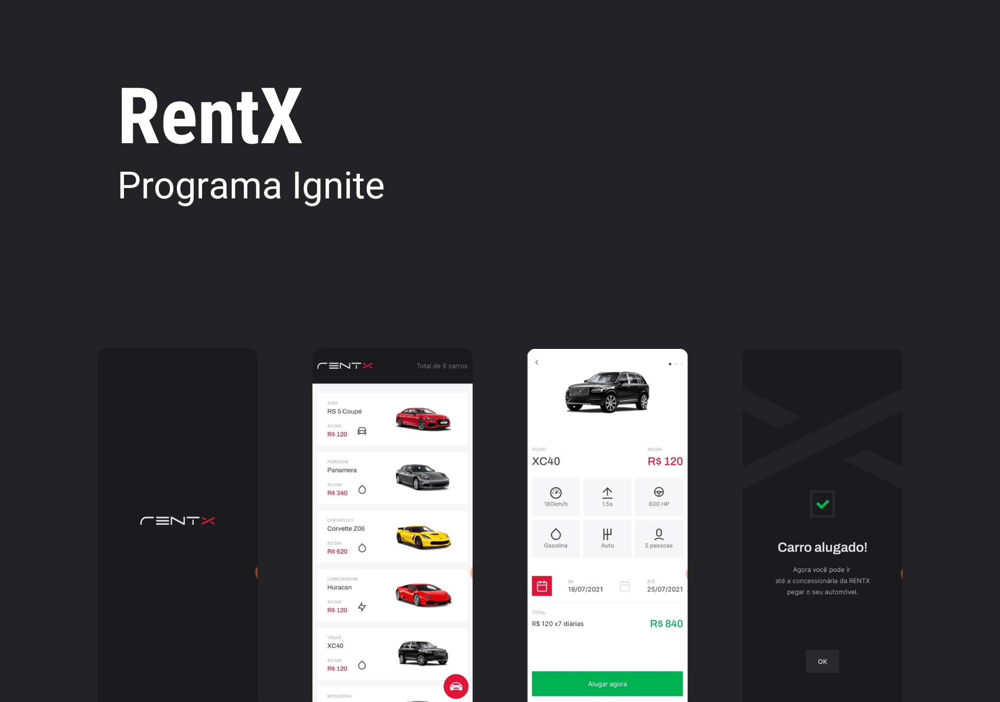
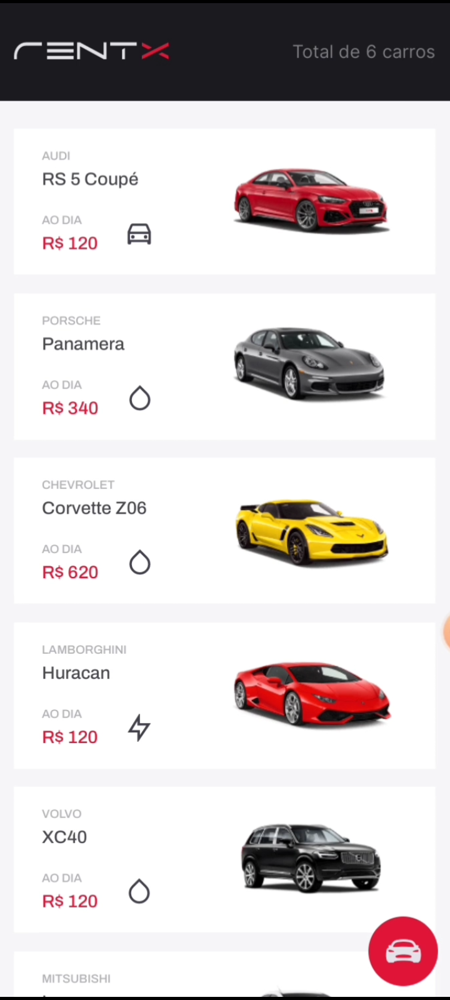
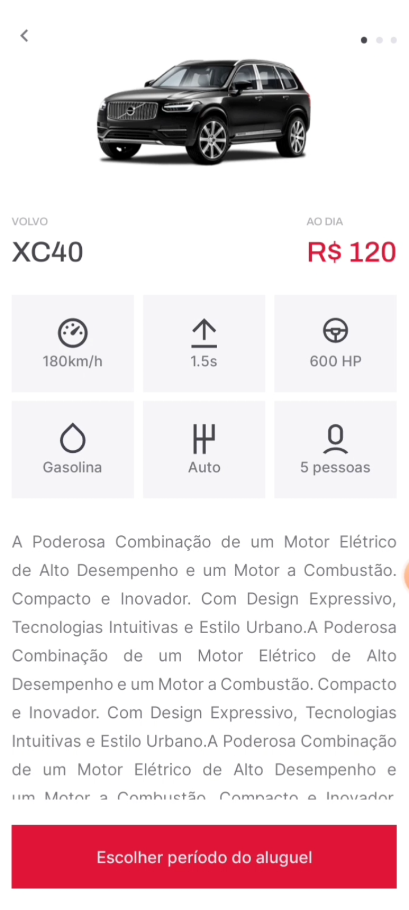
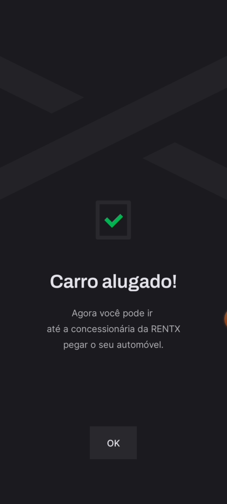

<h1 align="center">
    
</h1>

## 💻 Sobre o projeto

A aplicação visa tornar o aluguel de carros descomplicado, no qual o usuário de forma fácil consegue escolher seu veículo, período do aluguel e já na mesma hora realizar o aluguel.

Foi desenvolvido durante a trilha de React Native no programa Ignite da Rocketseat.

---

## ⚙️ Funcionalidades

- Ver lista de veículos disponíveis.
- Escolher um veículos para alugar.
- Selecionar o período de aluguel do veículo.
- Alugar um veículo.
- Ver histórico.

Para o desenvolvimento foram aplicados conceitos como:
- API integration
- Routes
- Typescript
- Components
- Hooks
- Models
- Schemas
- DTOS
- Migrations

---

## 🎨 Layout

### Mobile

  

  

  

  

  

  

---

## 🛠 Tecnologias
Principais ferramentas que foram usadas na construção do projeto:

#### **Backend**  [Node.js](https://nodejs.org/en)

-   **[Express](https://www.npmjs.com/package/express)**
-   **[SQLite3](https://www.npmjs.com/package/sqlite3)**
-   **[TypeORM](https://www.npmjs.com/package/typeorm)**
-   **[uuid](https://www.npmjs.com/package/uuid)**
-   **[bcrypt](https://www.npmjs.com/package/bcrypt)**
-   **[jsonwebtoken](https://www.npmjs.com/package/jsonwebtoken)**
-   **[reflect-metadata](https://www.npmjs.com/package/reflect-metadata)**
-   **[tsyringe](https://www.npmjs.com/package/tsyringe)**

#### **Mobile**  [Expo](https://expo.dev/)

-   **[Axios](https://www.npmjs.com/package/axios)**
-   **[Expo Image Picker](https://docs.expo.dev/versions/latest/sdk/imagepicker/)**
-   **[Expo Splash Screen](https://docs.expo.dev/guides/splash-screens/)**
-   **[Expo Updates](https://docs.expo.dev/versions/latest/sdk/updates/)**
-   **[Date FNS](https://date-fns.org/)**
-   **[React Native Calendars](https://www.npmjs.com/package/react-native-calendars)**
-   **[Styled Components](https://styled-components.com/)**
-   **[Yup](https://www.npmjs.com/package/yup)**

---

## 🦸 Autor

  
 <b>Everton Schultz</b></a>
  

